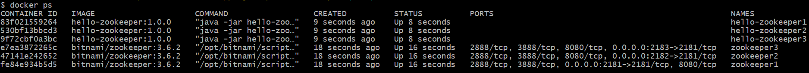
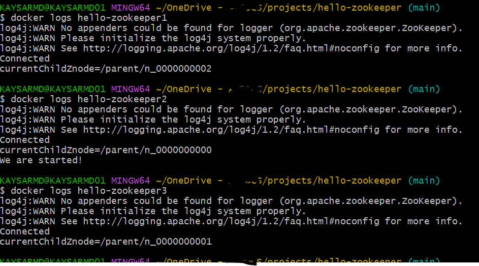

# hello-zookeeper

# Problem Statement:

Imagine an environment that consists of multiple nodes. Each node is a separate JVM process and could 
potentially be running on a distinct physical machine. Your task is to write an application that will 
run on all nodes. The application should coordinate between the nodes so that as they are started 
System.out.println ("We are started!") is only called exactly once across the whole cluster, 
whether 1 node or 10 are running.

# Problem Analysis

The problem states that the java application will be running on multiple node (separate physical machine 
or VM) and only one node (JVM process) will be printing a message on startup even multiple nodes are started at a time. 

Therefore - each nodes need to know if the message is already printed by another node before its printing.

# Solution
This above problem can be solved using Apache Zookeeper which is an opensource co-ordination service and
widely used highly scalable configuration management, co-ordinating services, handling race-condition, distributed 
locking, deadlock prevention, leader election in a distributed environment. 

We will use leader election service of apache zookeeper to solve the problem.

## Leader Election

Leader election is a critical aspect of distributed systems, ensuring that tasks are managed efficiently by designating 
one node as the leader. ZooKeeper, with its robust coordination capabilities, simplifies this process. 
By using ZooKeeper’s atomic broadcast protocol, ZAB (ZooKeeper Atomic Broadcast), distributed systems can elect a 
leader reliably and efficiently. The use of ephemeral and sequential nodes in ZooKeeper provides an effective mechanism
for leader election, ensuring that the system remains consistent and fault-tolerant even when nodes fail or network partitions occur. 
Leader Election Process includes:

- Ephemeral Sequential Nodes: Each participating node creates an ephemeral sequential node in ZooKeeper. These nodes are temporary and are automatically deleted when the session ends.
- Nodes create their ephemeral sequential nodes in a designated ZooKeeper path. This ensures each node has a unique identifier.
- Detecting the Leader: The node with the smallest sequence number is elected as the leader. If this node fails, the next node in line becomes the leader.
- Node Deletion: When a node is deleted, the nodes that were watching it are notified. These nodes then check if they are the new leader.
- Rechecking Leadership: Nodes recheck their status when the watched node is deleted. This ensures that the leader role is always occupied.

# Tools and library used
- maven (3.9.9) for dependency management
- java 8
- Apache Zookeeper client library
- docker and docker-compose to startup zookeeper cluster and run the multiple instance of application.

# Build
- mvn clean package

# Run Simulation - 3 node apache zookeeper and 3 process of the java application

- ./start-simulation.sh 
- ./stop-simulation.sh # for stopping the java application

## Notes:
- we have used Thread.sleep(Long.MAX_VALUE) and logged current node names to simulate the work - which was not mentioned in the requirement. 

# Output snapshot:

## Nodes running

## Logs of the application

From the logs we can see only node number printed the expected message ("We are started!")